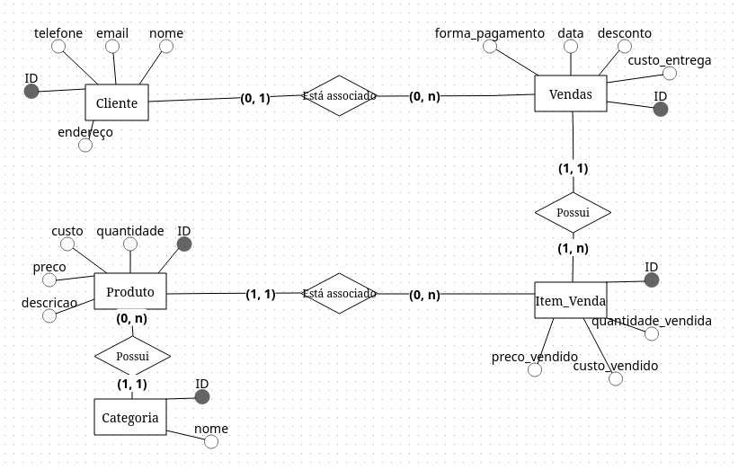

## Sistema de Gerenciamento de Estoque

  

## Sobre 

Código Front-end criado durante o Projeto de Extensão em soluções tecnológicas na cidade de Esperança e região - IDEAÇÂO (2023).

Nesse projeto, foi atendida um microempreendedora local da cidade de Esperança, e então foi desenvolvido um sistema de informação para atender problemas do dia a dia encontrados no negócio da microempreendedora. O sistema se tratou de sistema gerenciador de clientes, produtos e registros de vendas. 

O desenvolvimento do projeto ocorreu entre os meses de maio até novembro, sendo entregue para a cliente no início do mês de dezembro. O front-end foi desenvolvido utilizando o framework React.js, fazendo uso de bibliotecas como Ant Design, React Router, Axios e Redux. O back-end foi desenvolvido utilizando o Strapi.io.

### Esquema de Banco de Dados (Diagrama UML)

